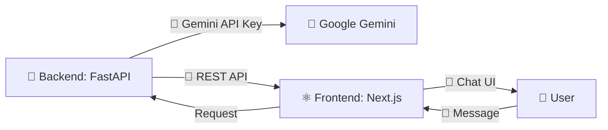

<div align="center">


<br/>


<br/>

🌐 **Live Demo:** [ai-chatbot-aah18751.vercel.app](https://ai-chatbot-aah18751.vercel.app/)

<a href="https://ai-chatbot-aah18751.vercel.app/">

</a>

</div>

<br/>

## 🤖 About

A production ready, full stack AI Chatbot application featuring a fast Python FastAPI backend and a responsive Next.js frontend, powered by the Google Gemini API.

<div align="center">

</div>

---

## 📁 Project Structure

```
AI-Chatbot/
├── 🗂️ backend/     # Python FastAPI application that connects to the Gemini API
├── 🗂️ frontend/    # Next.js (App Router, Tailwind CSS, TypeScript) user interface
├── 🚫 .gitignore
├── 📘 README.md
└── 📋 requirements.txt
```

<br/>

## ✨ Features

- 📌 Dynamic and responsive sidebar managing multiple chat sessions.
- 💾 State persistence using localStorage to keep history across reloads.
- 🎨 Beautiful, premium UI featuring dark theme and smooth micro animations.
- 🏷️ Autorename chat sessions dynamically based on the first user message.
- 📋 Custom code block renderer with instant copy to clipboard functionality.
- ⚡ Fast responses powered by the `gemini-1.5-flash` model.
- 🛡️ Robust error callout handling with connection recovery.

<br/>

## ✅ Prerequisites

<div align="center">

| Requirement | Details | Icon |
|---|---|---|
| 🪟 **Operating System** | Windows 11 | 🪟 |
| 🟢 **Node.js** | v18.0.0 or later | 🟢 |
| 🐍 **Python** | v3.10 or later | 🐍 |
| 🔑 **Google Gemini API Key** | Required for backend | 🔑 |

</div>

<br/>

## 🚀 Setup and Running

<div align="center">



</div>

<details open>
<summary><b>1️⃣ 🐍 Backend Configuration</b></summary>
<br/>

Open a Windows PowerShell or CMD terminal and navigate to the backend directory:

```cmd
cd backend
python -m venv venv
venv\Scripts\activate
pip install -r requirements.txt
```

Create a `.env` file in the `backend` folder (a default key template is provided):

```env
GEMINI_API_KEY=YOUR_GEMINI_API_KEY
PORT=8000
```

Start the backend development server:

```cmd
uvicorn main:app --reload --port 8000
```

The API will now be running at `http://127.0.0.1:8000`. ✅

</details>

<details open>
<summary><b>2️⃣ ⚛️ Frontend Configuration</b></summary>
<br/>

Open another Windows PowerShell or CMD terminal and navigate to the frontend directory:

```cmd
cd frontend
npm install
```

Start the frontend development server:

```cmd
npm run dev
```

Open `http://localhost:3000` in your web browser to access the application. 🎉

</details>

<br/>

## 🛠️ Tech Stack

<div align="center">


&nbsp;

&nbsp;

&nbsp;

&nbsp;

&nbsp;


</div>

<br/>

## 👤 Creator Profile

Developed by [AbdulAzeemHashmi](https://github.com/AbdulAzeemHashmi). 🧑‍💻

<br/>

<div align="center">

### ⭐ If you found this project helpful, consider giving it a star

<a href="https://github.com/AbdulAzeemHashmi/AI-Chatbot/stargazers">

</a>

<br/><br/>

Made with 🤖 and Gemini powered intelligence by Abdul Azeem.


</div>
